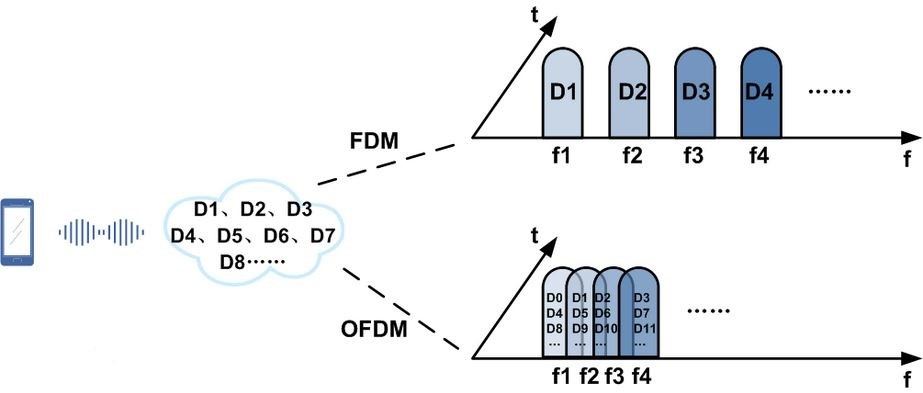

## 描述

移动通信的时代，安全已经不仅限与互联网TCP/IP上的攻防，军用射频通信技术现已大量民用化。如今移动设备以及射频通信技术已经走进千家万户，作为一个黑客，不懂无线技术怎么能行。当今的LTE技术使用了曾经的军用调制技术OFDM。OFDM即正交频分复用技术，实际上OFDM是MCM(Multi Carrier Modulation)，多载波调制的一种。在3G到4G演进的过程中起到了举足轻重的作用。

上图是OFDM的原理简图大家随便看看就好。现在问题来了，出题人在和主办方沟通的时候竟然傻逼的把FLAG用4G网发了出去，假设这时候你来不及使用专用的LTE监听设备，而简单使用了频谱分析仪截获了这段RF载波，你能从中分析出FLAG吗？

为了简单起见，有如下假设：

1. 假设信道噪声只是简单的正态分布噪声，无镜像反射等复杂情况。信噪比SNR=15dB
2. LTE信道存在非常强的加密，我不需要你知道明文内容，只要知道被调制的基带数据就可以了，解调出的基带直接提交。
3. 为了进一步让这道题简单一点，给出如下信息：

   信道子载波数为20

   每子载波含符号数为6

   每信道采用16QAM调制，每符号含比特数为4

   OFDM调制FFT长度为512

   保护间隔与OFDM数据比例为1:4

   每一个OFDM符号添加的循环前缀长度为FFT长度的1/4，即保护间隔长度为128

   窗函数滚降系数为1/32

   OFDM循环后缀长度为20

   以上有些信息是冗余的，自行选择需要的信息，本题由于给出了FFT长度，所以和采样频率就无关了，不要问我采样频率多少。
4. 根据第3个假设给出的信息，你其实已经可以计算出FLAG的长度了。

## 题解

完全看不懂，但是网上搜了下 `OFDM 解调` 得到一些 matlab 源码，猜测有人写过，再搜了一下 `matlab OFDM 解调`（大概是这个，记不得了），然后找到一篇文章

https://wenku.baidu.com/view/175252a669dc5022aaea00bb.html

里面提供的代码对上了题目里的所有参数，稳！

然后发现，自己更不跑不起来他这个代码啊。。。更别说改了。。

有毒。。

占坑吧。

## 答案

