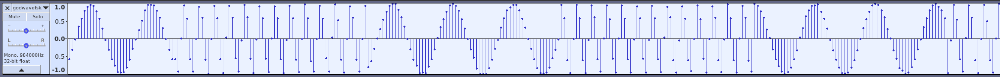

## 描述

XMAN训练营课后作业。上帝之音FSK版。

[godwavefsk.wav.9fc29fc3b7fe4c3cb4ddb35e1e79e320](./assets/godwavefsk.wav.9fc29fc3b7fe4c3cb4ddb35e1e79e320)

## 题解

应该和 [上帝之音](./上帝之音.md) 有相似之处，先看看波形图



特别明显的规律。同样是 64 个点一组，然后按照规律搞搞就好。

```python
import wave
import numpy as np
import bitarray
w = wave.open('godwavefsk.wav.9fc29fc3b7fe4c3cb4ddb35e1e79e320', 'r')

raw = w.readframes(w.getnframes())
data = np.fromstring(raw, dtype=np.int16)
data = data * 1.0 / max(abs(data))

out = ''
s = 0
for i in range(1, len(data)):
    if data[i] < 0 and data[i - 1] > 0:
        s += 1
    if (i + 1) % 64 == 0:
        if s > 5:
            out += '0'
        else:
            out += '1'
        s = 0

ans = bitarray.bitarray()
for i in range(1, len(out), 2):
    if out[i - 1] == '1' and out[i] == '0':
        ans.append(True)
    if out[i - 1] == '0' and out[i] == '1':
        ans.append(False)

ans.tofile(open('data', 'wb'))
```

再用 `$ zbarimg data` 即可得到 flag

## 答案

CTF{Nice_FSK_D3ModUl47o2}
