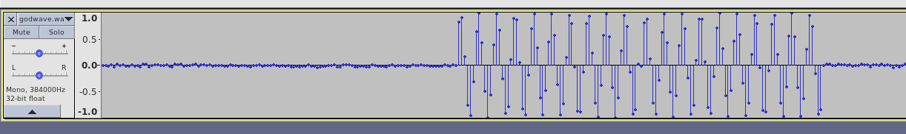

## 描述

这是一段神奇的声音，可是上帝之音似乎和无字天书一样，是我们这些凡人无法理解的，你能以上帝的角度，理解这段WAV的含义么？

Hint1: 你们做音频题都不喜欢看时域图？
Hint2: 在数据传输过程中，我们往往会使用一种自带时钟的编码以减少误码率

[godwave.wav.26b6f50dfb87d00b338b58924acdbea1](./assets/godwave.wav.26b6f50dfb87d00b338b58924acdbea1)

## 题解

根据提示，应该不是隐写啥的，直接看是波形图。

用 `Audacity` 打开，然后更改频率尽量放大一点，类似这样：



大部分都是这样有周期性的，数了数点的个数大概有 64 个。猜测有波幅的就是 1，啥也没有的就是 0。

然后搜索第二个提示，`自带时钟的编码`，得知有：曼彻斯特编码、差分曼彻斯特编码。了解了他们的原理可以发现，曼彻斯编码就是数电里的上升沿、下降沿的 0、1 编码（两个 bit 判断一次，不交叉）。先试试曼彻斯编码。

```python
import wave
import numpy as np
import bitarray
w = wave.open('godwave.wav.26b6f50dfb87d00b338b58924acdbea1', 'r')

raw = w.readframes(w.getnframes())
data = np.fromstring(raw, dtype=np.int16)
data = data * 1.0 / max(abs(data))

out = ''
s = 0
for i in range(len(data)):
    s += abs(data[i])
    if (i + 1) % 64 == 0:
        if s > 10:
            out += '1'
        else:
            out += '0'
        s = 0

ans = bitarray.bitarray()
for i in range(1, len(out), 2):
    if out[i - 1] == '1' and out[i] == '0':
        ans.append(True)
    if out[i - 1] == '0' and out[i] == '1':
        ans.append(False)

ans.tofile(open('data', 'wb'))
```

然后就得到了个二维码图片。。无聊搜了下 Linux 下读二维码图片的照片，可以用 `$ zbarimg a.png` 来读

## 答案

PCTF{Good_Signal_Analyzer}
